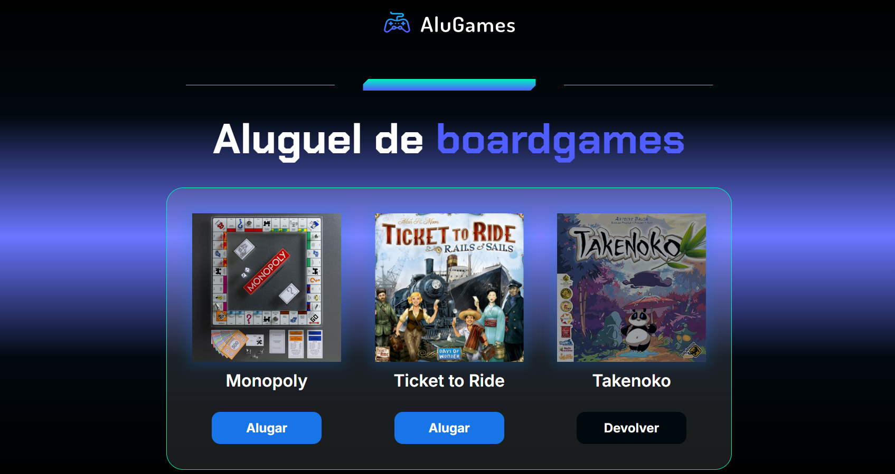

# AluGames

AluGames é um e-commerce fictício desenvolvido como parte de um curso da Alura. O projeto permite que os usuários aluguem boardgames de forma intuitiva, utilizando tecnologias web modernas.

## 🚀 Tecnologias Utilizadas

<table>
  <tr>
    <td align="center">
      
       HTML5
    </td>
    <td align="center">
      
       CSS3
    </td>
    <td align="center">
      
       JavaScript
    </td>
  </tr>
</table>

## 🎮 Funcionalidades

- Botões de **Alugar** e **Devolver** jogos
- Ao alugar um jogo:
  - A imagem do jogo fica escurecida para indicar que está indisponível
  - O botão muda para "Devolver" para facilitar a experiência do usuário
- Ao devolver um jogo:
  - Uma confirmação é exibida para evitar devoluções acidentais
  - O jogo retorna ao estado normal, permitindo um novo aluguel

## 📌 Melhorias Futuras

- Implementação de um design responsivo para dispositivos móveis
- Adição de animações para uma experiência mais fluida
- Integração com banco de dados para armazenar informações dos aluguéis

## 📸 Preview do Projeto

---

## 🙌 Agradecimento Especial  

Gostaria de expressar minha gratidão aos incríveis professores da **Alura**, que compartilharam seus conhecimentos e contribuíram para meu aprendizado nesta jornada. Muito Obrigado! 🚀

### 🎓 **Jacqueline Oliveira**  
  
  

---

### 🎓 **Rodrigo da Silva Ferreira Caneppele**  
  
  

